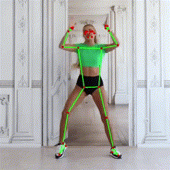
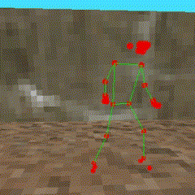
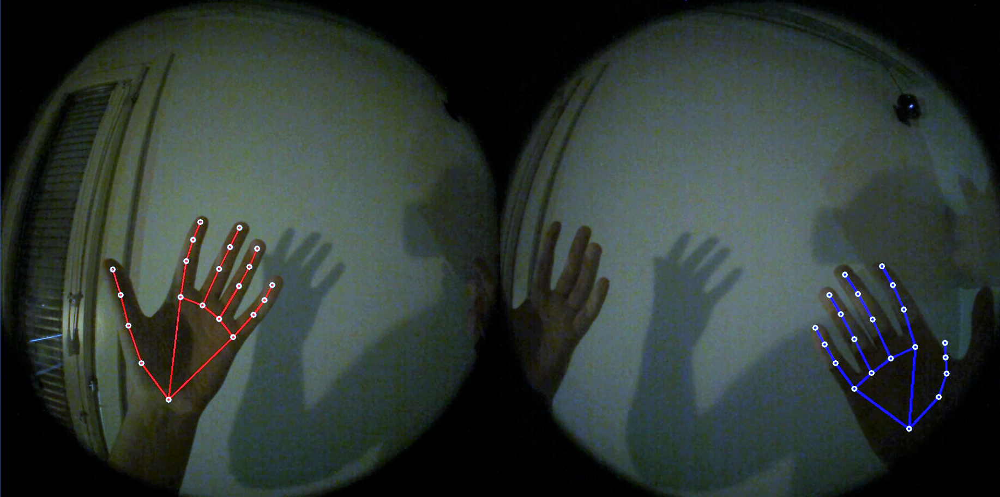

### Motion capture animation using google mediapipe

`pose.py` tracks and serializes binary file

Inverse project from screenspace to worldspace  
Fix jittering with smooth sampling multiple frames

For 3D animation, missing camera pose estimation model  
(mediapipe tracks joints in screenspace),  
so for 3D animation to work camera must be still and  
pitch 90° from ground (or set manually)  

To retarget skeleton: blender rokoko or some motion retargeting

#### Handtracking on valve index cameras

